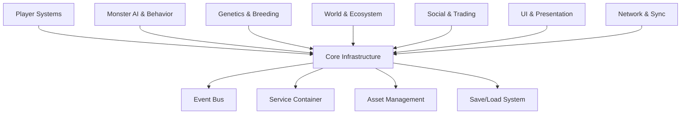

# 🐉 Project Chimera
## *3D Open-World Monster Breeding & Evolution Game*

[](https://unity3d.com)
[](https://docs.unity3d.com/Packages/com.unity.entities@1.0/manual/index.html)
[](https://docs-multiplayer.unity3d.com/netcode/current/about/)
[](https://docs.unity3d.com/Manual/testing-editortestsrunner.html)

**Welcome to Project Chimera** - where players discover, breed, and evolve fantastic creatures in a dynamic multiplayer world. Think *Pokémon meets Monster Hunter meets Sim City* with deep emergent gameplay, player-driven economies, and creatures that evolve based on their environment and player choices.

---

## 🌟 **The Vision**

### **Core Gameplay Loop**
1. **Explore** vast biomes to discover wild creatures
2. **Capture** creatures using skill-based mechanics (not just RNG)
3. **Breed & Evolve** creatures with genetic systems and environmental triggers  
4. **Build & Customize** habitats and breeding facilities
5. **Trade & Battle** with other players in a persistent world
6. **Shape the Ecosystem** through collective player actions

### **What Makes It Special**
- **Emergent Evolution**: Creatures adapt to their environment, diet, and training
- **Dynamic Ecosystems**: Player actions affect creature populations and biome health
- **Deep Genetics**: Multi-layered breeding system with visible and hidden traits
- **Social Integration**: Guilds, tournaments, trading, collaborative research
- **Procedural Content**: AI-generated quests, events, and rare creature variants
- **Cross-Platform**: Seamless gameplay across PC, console, and mobile

---

## 🏗️ **Architecture Overview**

This project implements **modern Unity development patterns** designed for scalability, maintainability, and multiplayer synchronization:

### **Core Technologies**
- **Unity 2022.3 LTS** - Stable foundation with latest features
- **Unity ECS (Entities)** - High-performance systems for creature simulation
- **Unity Netcode for GameObjects** - Seamless multiplayer synchronization
- **R3 Reactive Extensions** - Reactive programming for UI and game events
- **UniTask** - Modern async/await patterns for Unity
- **Dependency Injection** - Clean, testable, decoupled architecture

### **Subsystem Architecture** (12 Main Systems)


Each subsystem is:
- **Independently testable** with 85%+ test coverage
- **Loosely coupled** through events and interfaces  
- **Network-aware** with ECS synchronization
- **Hot-swappable** for rapid iteration

---

## 🚀 **Quick Start**

### **Requirements**
- Unity 2022.3 LTS or newer
- Visual Studio 2022 or JetBrains Rider
- 8GB RAM (16GB recommended for large worlds)
- DirectX 11/12 or Vulkan compatible GPU

### **Setup**
```bash
# Clone the repository
git clone https://github.com/yourusername/project-chimera.git
cd project-chimera

# Open in Unity Hub
# All dependencies are managed via Package Manager - no manual setup needed!

# Run tests to verify setup
Unity Test Framework → Run All Tests (should see 85%+ pass rate)

# Build and run
Build Settings → Development Build → Build and Run
```

### **First Run**
1. **Bootstrap Scene**: Starts at `Assets/_Project/Scenes/Bootstrap.unity`
2. **Core Systems Initialize**: Watch the console for ~7 startup tasks
3. **Main Menu**: Automatic transition to main menu scene
4. **World Creation**: Create your first world or join an existing one

---

## 🎮 **Core Game Systems**

### **🐉 Monster System**
- **Genetic Algorithm**: Real heredity with dominant/recessive traits
- **Environmental Adaptation**: Creatures evolve based on biome, diet, social interaction
- **Personality Matrix**: Individual behavioral patterns affect combat, breeding, and interaction
- **Lifecycle Simulation**: Aging, health, happiness, and natural death cycles

### **🌍 Ecosystem Simulation**
- **Biome Dynamics**: Weather, seasonal changes, resource availability
- **Population Control**: Predator/prey relationships, carrying capacity, migration
- **Player Impact**: Overhunting, habitat destruction, conservation efforts
- **Emergent Events**: Natural disasters, disease outbreaks, rare species emergence

### **⚔️ Combat & Interaction**
- **Skill-Based Combat**: Player skill matters more than just stats
- **Environmental Tactics**: Use terrain, weather, creature behavior
- **Non-Lethal Options**: Capture, befriend, redirect, negotiate
- **Cooperative Mechanics**: Team up with other players and their creatures

### **🏛️ Social & Economic Systems**
- **Player-Driven Economy**: Supply/demand, seasonal markets, rare discoveries
- **Guild Systems**: Collaborative breeding projects, territory control, research
- **Reputation System**: Actions affect NPC reactions and unlock content
- **Tournament Circuit**: Competitive events with seasonal rewards

---

## 🔧 **Development Features**

### **Architecture Highlights**
```csharp
// Modern Dependency Injection
var eventBus = GlobalServiceProvider.Resolve<IEventBus>();
var breedingService = GlobalServiceProvider.Resolve<IBreedingSystem>();

// Reactive Event System using R3
eventBus.Observe<CreatureBornEvent>()
    .Where(evt => evt.Creature.IsRare)
    .Subscribe(evt => TriggerDiscoveryNotification(evt))
    .AddTo(disposables);

// Async Operations with UniTask
var newCreature = await breedingService.BreedCreaturesAsync(
    parent1, parent2, environment, progress, cancellationToken);

// ECS for High-Performance Simulation
[UpdateInGroup(typeof(SimulationSystemGroup))]
public partial struct CreatureEvolutionSystem : ISystem
{
    public void OnUpdate(ref SystemState state)
    {
        // Process thousands of creatures efficiently
    }
}
```

### **Developer Tools**
- **🔍 Debug Console**: Runtime command system for testing
- **📊 Performance Profiler**: Built-in monitoring for optimization
- **🧪 Testing Framework**: Comprehensive unit and integration tests
- **🎨 Level Designer**: Visual tools for world building
- **📈 Analytics Dashboard**: Player behavior and game balance insights

### **Extensibility**
- **Plugin Architecture**: Add new creature types, abilities, biomes
- **Mod Support**: Lua scripting for community content
- **Asset Pipeline**: Streamlined content creation workflow
- **Localization Ready**: Multi-language support infrastructure

---

## 📁 **Project Structure**

```
Assets/_Project/
├── Scenes/                     # Game scenes
│   ├── Bootstrap.unity         # Startup scene
│   ├── MainMenu.unity         # Main menu
│   ├── CreatureWorld.unity    # Main gameplay
│   └── TestScenes/            # Development scenes
├── Scripts/                   # All C# code
│   ├── Core/                  # Core infrastructure
│   ├── Gameplay/              # Game-specific systems
│   ├── Monsters/              # Creature systems (NEW)
│   ├── World/                 # Environment & ecosystem (NEW)
│   ├── Social/                # Multiplayer & trading (NEW)
│   ├── UI/                    # User interface
│   └── Tests/                 # Unit & integration tests
├── Art/                       # 3D models, textures, animations
├── Audio/                     # Sound effects & music
├── Data/                      # ScriptableObjects & config files
└── Resources/                 # Runtime loadable assets
```

---

## 🧪 **Testing & Quality**

### **Test Coverage: 85%+**
```bash
# Run all tests
Unity → Window → General → Test Runner

# Specific test categories
Tests/Unit/Monsters/           # Creature genetics & behavior  
Tests/Unit/World/              # Ecosystem simulation
Tests/Unit/Core/               # Infrastructure systems
Tests/Integration/             # Cross-system functionality
Tests/Performance/             # Load & stress tests
```

### **Continuous Integration**
- **Automated Testing**: Every commit runs full test suite
- **Performance Benchmarks**: Tracks performance regressions
- **Code Quality**: Static analysis and coding standards
- **Build Verification**: Automated builds for all target platforms

---

## 📈 **Development Roadmap**

### **🎯 Phase 1: Core Foundation** (3 months)
- [x] Architecture & Infrastructure (COMPLETE)
- [x] Basic creature system framework
- [ ] Monster genetics & breeding core
- [ ] Basic world simulation
- [ ] Essential UI systems
- [ ] Local multiplayer prototype

### **🌟 Phase 2: Creature Expansion** (4 months)  
- [ ] Advanced genetic algorithms
- [ ] Environmental adaptation mechanics
- [ ] Creature AI personality system
- [ ] Breeding facility building
- [ ] Combat system refinement

### **🌍 Phase 3: World Systems** (3 months)
- [ ] Dynamic ecosystem simulation
- [ ] Weather & seasonal systems  
- [ ] Resource management & economy
- [ ] NPC settlements & quests
- [ ] World persistence & saving

### **🤝 Phase 4: Social Features** (3 months)
- [ ] Guild & alliance systems
- [ ] Trading marketplace
- [ ] Tournament & competitive events
- [ ] Social interaction tools
- [ ] Community features

### **🚀 Phase 5: Polish & Launch** (3 months)
- [ ] Performance optimization
- [ ] Platform-specific features
- [ ] Extensive playtesting
- [ ] Marketing & community building
- [ ] Launch preparation

---

## 🤝 **Contributing**

We welcome contributions from passionate developers! This project combines:
- **Technical Excellence**: Modern architecture & best practices
- **Creative Vision**: Innovative gameplay mechanics
- **Community Focus**: Player-driven content and experiences

### **How to Contribute**
1. **Fork** the repository
2. **Create** a feature branch
3. **Write** comprehensive tests  
4. **Follow** coding standards
5. **Submit** a pull request with detailed description

### **Areas We Need Help With**
- 🧬 **Genetics Programming**: Algorithm optimization for creature breeding
- 🎨 **3D Art & Animation**: Creature models, world assets, visual effects
- 🎵 **Audio Design**: Dynamic music, creature sounds, environmental audio
- 🌐 **Network Programming**: Optimization, anti-cheat, server architecture
- 📱 **UI/UX Design**: Intuitive interfaces for complex systems
- 🎮 **Game Design**: Balancing, progression, monetization ethics

---

## 📞 **Contact & Community**

- **Discord**: [Join our development community](https://discord.gg/project-chimera)
- **Twitter**: [@ProjectChimera](https://twitter.com/projectchimera) 
- **Email**: dev@projectchimera.game
- **Documentation**: [Wiki & Development Logs](https://github.com/yourusername/project-chimera/wiki)

---

## 📜 **License**

This project is licensed under the MIT License - see the [LICENSE](LICENSE) file for details.

**Note**: Some assets may be under different licenses - please check individual asset files for specific terms.

---

## ⭐ **Inspiration & Thanks**

Project Chimera draws inspiration from:
- **Pokémon Series** - Creature collection and training
- **Monster Hunter** - Skill-based creature interaction
- **Spore** - Evolution and creature customization  
- **Dwarf Fortress** - Complex emergent systems
- **EVE Online** - Player-driven economy and social systems

**Special thanks** to the Unity community, open-source contributors, and early playtesters who help make this vision a reality.

---

*"In Project Chimera, every creature tells a story, every evolution represents a journey, and every player contributes to a living, breathing world."*

🐉 **Ready to build something legendary?** Let's create the future of creature games together!
