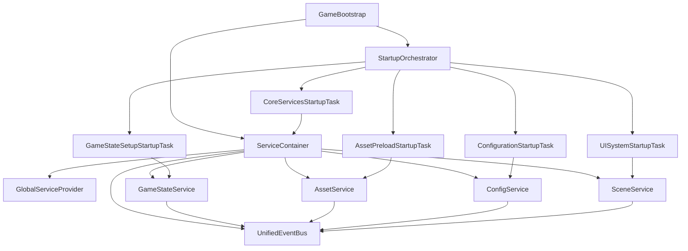

# 🏗️ Core Architecture Documentation

## Overview

The Core Architecture subsystem provides the foundational infrastructure for the Laboratory game project. It implements modern software architecture patterns including Dependency Injection, Event-Driven Architecture, and State Management.

## 📋 Table of Contents

- [Architecture Principles](#architecture-principles)
- [Subsystem Components](#subsystem-components)
- [Dependency Graph](#dependency-graph)
- [Usage Examples](#usage-examples)
- [Best Practices](#best-practices)
- [Migration Guide](#migration-guide)

## Architecture Principles

### 🔄 Dependency Injection
- **Inversion of Control**: Dependencies are injected rather than created
- **Service Locator Pattern**: GlobalServiceProvider provides access to services
- **Lifetime Management**: Singleton, Transient, and Scoped lifetimes supported

### 📡 Event-Driven Architecture
- **Unified Event Bus**: Single event system using UniRx
- **Loose Coupling**: Systems communicate through events, not direct references
- **Reactive Programming**: Observable patterns for responsive UI and gameplay

### 🎮 State Management
- **Centralized Game States**: Single source of truth for game state
- **Async Transitions**: Non-blocking state changes with proper lifecycle management
- **Event Integration**: State changes automatically publish events

### ⚡ Async-First Design
- **UniTask Integration**: Modern async/await patterns for Unity
- **Cancellation Support**: Proper cancellation token usage
- **Progress Reporting**: Built-in progress tracking for long-running operations

## Subsystem Components

### 1. Dependency Injection (`Core/DI/`)

#### IServiceContainer
```csharp
public interface IServiceContainer : IDisposable
{
    void Register<TInterface, TImplementation>(ServiceLifetime lifetime = ServiceLifetime.Singleton);
    void RegisterInstance<T>(T instance) where T : class;
    T Resolve<T>() where T : class;
    bool TryResolve<T>(out T? service) where T : class;
    IServiceScope CreateScope();
    bool IsRegistered<T>() where T : class;
}
```

#### GlobalServiceProvider
Static service locator that provides global access to the dependency injection container.

```csharp
// Initialize during bootstrap
GlobalServiceProvider.Initialize(serviceContainer);

// Access services from anywhere
var eventBus = GlobalServiceProvider.Resolve<IEventBus>();
```

### 2. Event System (`Core/Events/`)

#### IEventBus
Unified event system using UniRx for reactive programming.

```csharp
public interface IEventBus : IDisposable
{
    void Publish<T>(T message) where T : class;
    IDisposable Subscribe<T>(Action<T> handler) where T : class;
    UniRx.IObservable<T> Observe<T>() where T : class;
    IDisposable SubscribeOnMainThread<T>(Action<T> handler) where T : class;
    IDisposable SubscribeWhere<T>(Func<T, bool> predicate, Action<T> handler) where T : class;
    IDisposable SubscribeFirst<T>(Action<T> handler) where T : class;
    int GetSubscriberCount<T>() where T : class;
    void ClearSubscriptions<T>() where T : class;
}
```

#### Event Messages
Standardized event messages for common game events:
- `LoadingStartedEvent`, `LoadingProgressEvent`, `LoadingCompletedEvent`
- `GameStateChangedEvent`, `GameStateChangeRequestedEvent`
- `DamageEvent`, `DeathEvent`
- `SceneChangeRequestedEvent`

### 3. Core Services (`Core/Services/`)

#### IAssetService
Handles asset loading from multiple sources with caching.

```csharp
public interface IAssetService
{
    UniTask<T?> LoadAssetAsync<T>(string key, AssetSource source = AssetSource.Auto) where T : UnityEngine.Object;
    UniTask LoadAssetsAsync(IEnumerable<string> keys, AssetSource source = AssetSource.Auto);
    UniTask PreloadCoreAssetsAsync(IProgress<float>? progress = null, CancellationToken cancellation = default);
    T? GetCachedAsset<T>(string key) where T : UnityEngine.Object;
    bool IsAssetCached(string key);
    void UnloadAsset(string key);
    void ClearCache();
    AssetCacheStats GetCacheStats();
}
```

#### IConfigService
Configuration loading and validation.

```csharp
public interface IConfigService
{
    UniTask<T?> LoadJsonConfigAsync<T>(string relativePath) where T : class;
    UniTask<T?> LoadScriptableObjectConfigAsync<T>(string resourcePath) where T : ScriptableObject;
    T? GetCachedConfig<T>(string key) where T : class;
    UniTask PreloadEssentialConfigsAsync(IProgress<float>? progress = null, CancellationToken cancellation = default);
    bool ValidateConfig<T>(T config) where T : class;
    void ClearCache();
}
```

#### ISceneService
Scene management with preloading and progress tracking.

```csharp
public interface ISceneService
{
    string? CurrentScene { get; }
    UniTask LoadSceneAsync(string sceneName, LoadSceneMode mode = LoadSceneMode.Single, 
        IProgress<float>? progress = null, CancellationToken cancellation = default);
    UniTask UnloadSceneAsync(string sceneName, IProgress<float>? progress = null, 
        CancellationToken cancellation = default);
    UniTask PreloadSceneAsync(string sceneName, CancellationToken cancellation = default);
    void ActivatePreloadedScene(string sceneName);
    bool IsSceneLoaded(string sceneName);
    IReadOnlyList<string> GetLoadedScenes();
}
```

### 4. Game State Management (`Core/State/`)

#### IGameStateService
Centralized state management with async transitions.

```csharp
public interface IGameStateService
{
    GameState Current { get; }
    UniRx.IObservable<GameStateChangedEvent> StateChanges { get; }
    UniTask<bool> RequestTransitionAsync(GameState targetState, object? context = null);
    void ApplyRemoteStateChange(GameState newState, bool suppressEvents = true);
    void RegisterState<T>() where T : IGameState, new();
    void RegisterState<T>(Func<T> factory) where T : IGameState;
    IGameState? GetCurrentStateImplementation();
    bool CanTransitionTo(GameState targetState);
    void Update();
}
```

#### Game States
```csharp
public enum GameState
{
    None,
    Initializing,
    MainMenu,
    Loading,
    Playing,
    Paused,
    GameOver,
    Disconnecting
}
```

### 5. Bootstrap System (`Core/Bootstrap/`)

#### GameBootstrap
Main bootstrap that initializes all systems using the StartupOrchestrator.

```csharp
public class GameBootstrap : MonoBehaviour
{
    // Initializes the entire game architecture
    private async UniTask InitializeAsync(CancellationToken cancellation)
    {
        CreateServiceContainer();
        RegisterCoreServices();
        await _orchestrator.InitializeAsync(_services, progress, cancellation);
        await PostInitializationSetupAsync();
    }
}
```

#### Startup Tasks
Ordered initialization tasks:
1. `CoreServicesStartupTask` (Priority: 10)
2. `ConfigurationStartupTask` (Priority: 20) 
3. `AssetPreloadStartupTask` (Priority: 30)
4. `GameStateSetupStartupTask` (Priority: 40)
5. `GameSystemStartupTask` (Priority: 45)
6. `NetworkInitializationStartupTask` (Priority: 50)
7. `UISystemStartupTask` (Priority: 60)

## Dependency Graph



## Usage Examples

### 1. Basic Service Registration and Resolution

```csharp
// During bootstrap
var services = new ServiceContainer();
services.Register<IEventBus, UnifiedEventBus>();
services.Register<IGameStateService, GameStateService>();
GlobalServiceProvider.Initialize(services);

// From anywhere in the code
var eventBus = GlobalServiceProvider.Resolve<IEventBus>();
var stateService = GlobalServiceProvider.Resolve<IGameStateService>();
```

### 2. Event Publishing and Subscription

```csharp
// Publishing events
var damageEvent = new DamageEvent(target, source, 50f, DamageType.Normal, Vector3.down);
eventBus.Publish(damageEvent);

// Subscribing to events
var subscription = eventBus.Subscribe<DamageEvent>(OnDamageReceived);

// Reactive patterns with filtering
eventBus.Observe<DamageEvent>()
    .Where(evt => evt.Amount > 100f)
    .Subscribe(evt => Debug.Log("Critical damage!"))
    .AddTo(disposables);
```

### 3. State Management

```csharp
// Register custom states
stateService.RegisterState<MainMenuState>();
stateService.RegisterState<PlayingState>();

// Transition between states
await stateService.RequestTransitionAsync(GameState.MainMenu);
await stateService.RequestTransitionAsync(GameState.Playing);

// React to state changes
stateService.StateChanges
    .Subscribe(evt => Debug.Log($"State changed: {evt.PreviousState} → {evt.CurrentState}"))
    .AddTo(disposables);
```

### 4. Asset Loading

```csharp
// Load single asset
var prefab = await assetService.LoadAssetAsync<GameObject>("UI/MainMenuPrefab");

// Preload with progress tracking
var progress = new Progress<float>(p => Debug.Log($"Loading: {p:P1}"));
await assetService.PreloadCoreAssetsAsync(progress);

// Check cache
if (assetService.IsAssetCached("UI/HUDPrefab"))
{
    var hudPrefab = assetService.GetCachedAsset<GameObject>("UI/HUDPrefab");
}
```

### 5. Scene Management

```csharp
// Load scene with progress tracking
var progress = new Progress<float>(p => UpdateLoadingBar(p));
await sceneService.LoadSceneAsync("GameLevel1", LoadSceneMode.Single, progress);

// Preload for faster transitions
await sceneService.PreloadSceneAsync("GameLevel2");
// Later...
sceneService.ActivatePreloadedScene("GameLevel2");
```

## Best Practices

### 🔧 Service Design
- **Single Responsibility**: Each service has one clear purpose
- **Interface Segregation**: Prefer smaller, focused interfaces
- **Dependency Injection**: Services depend on interfaces, not implementations
- **Async/Await**: Use UniTask for all async operations

### 📡 Event Design
- **Strong Typing**: Use specific event classes, not generic messages
- **Immutable Events**: Event data should not be modified after creation
- **Meaningful Names**: Event names should describe what happened, not what should happen
- **Context Data**: Include relevant context in event objects

### 🎮 State Management
- **Clear Transitions**: Define valid state transitions explicitly
- **Async Operations**: Use async methods for state transitions that require loading
- **Event Publishing**: All state changes should publish events
- **Validation**: Validate state transitions before executing

### ⚡ Performance
- **Service Caching**: Cache frequently resolved services
- **Event Filtering**: Use `SubscribeWhere` to filter events at the source
- **Disposal**: Always dispose subscriptions and services properly
- **Main Thread**: Use `SubscribeOnMainThread` for Unity API calls

### 🧪 Testing
- **Mock Services**: Create mock implementations for testing
- **Event Testing**: Test event publishing and subscription behavior
- **State Testing**: Verify state transitions and validation rules
- **Integration Tests**: Test service interactions in realistic scenarios

## Migration Guide

### From Old Event Systems

```csharp
// Old: Multiple event systems
DamageEventBus.Subscribe(OnDamageEvent);
MessageBus.OnDeath += OnDeathEvent;

// New: Unified event system
eventBus.Subscribe<DamageEvent>(OnDamageEvent);
eventBus.Subscribe<DeathEvent>(OnDeathEvent);
```

### From Direct Service Access

```csharp
// Old: FindObjectOfType and direct references
var audioManager = FindObjectOfType<AudioManager>();
var sceneManager = GetComponent<CustomSceneManager>();

// New: Dependency injection
var audioService = GlobalServiceProvider.Resolve<IAudioService>();
var sceneService = GlobalServiceProvider.Resolve<ISceneService>();
```

### From Manual State Management

```csharp
// Old: Manual state switching
currentState = GameState.Playing;
OnStateChanged?.Invoke(GameState.Playing);

// New: Proper state service
await stateService.RequestTransitionAsync(GameState.Playing);
```

## System Integration Points

### ECS Integration
- `GlobalServiceProvider` provides services to ECS systems
- `EventSystemBridge` bridges old events to new unified system
- `MessageBus` static class for ECS compatibility

### Network Integration  
- `ApplyRemoteStateChange` for network state synchronization
- Event serialization for network event propagation
- Service registration for network-specific implementations

### UI Integration
- Services provide data for UI systems
- Events drive UI updates reactively
- State changes automatically update UI elements

---

*This documentation is part of the Core Architecture subsystem for the Laboratory Unity project.*
