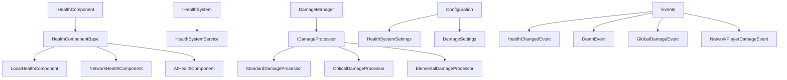

# 🩸 Health & Combat System Architecture Documentation

## Overview

The Health & Combat System provides a unified, extensible, and performant solution for managing health, damage, and combat mechanics across all game entities. The system follows modern Unity architecture patterns with dependency injection, event-driven communication, and comprehensive testing.

## 📋 Table of Contents

- [Architecture Principles](#architecture-principles)
- [System Components](#system-components)
- [Component Hierarchy](#component-hierarchy)
- [Usage Examples](#usage-examples)
- [Network Integration](#network-integration)
- [Configuration System](#configuration-system)
- [Testing Strategy](#testing-strategy)
- [Performance Considerations](#performance-considerations)
- [Integration Points](#integration-points)

## Architecture Principles

### 🔄 Unified Health Interface
- **Single Interface**: All health components implement `IHealthComponent`
- **Consistent API**: Standardized methods across Local, Network, and AI health components
- **Event-Driven**: Health changes trigger events for UI and game systems

### 🎯 Centralized Management
- **Health System Service**: Centralized registration and coordination of health components
- **Damage Manager**: Unified damage processing with pluggable processors
- **Statistics Tracking**: Comprehensive monitoring and analytics

### ⚡ Performance Optimized
- **Efficient Registration**: O(1) component lookup by GameObject
- **Memory Management**: Proper disposal patterns and event cleanup
- **Network Authority**: Server-authoritative damage with client feedback

### 🔧 Extensible Design
- **Damage Processors**: Pluggable damage modification system
- **Component Specialization**: Base class with specialized implementations
- **Configuration Driven**: ScriptableObject-based settings

## System Components

### 1. Core Interfaces

#### IHealthComponent
```csharp
public interface IHealthComponent
{
    int CurrentHealth { get; }
    int MaxHealth { get; }
    bool IsAlive { get; }
    float HealthPercentage { get; }
    
    event Action<HealthChangedEventArgs> OnHealthChanged;
    event Action<DeathEventArgs> OnDeath;
    
    bool TakeDamage(DamageRequest damageRequest);
    bool Heal(int amount, object source = null);
    void ResetToMaxHealth();
}
```

#### IHealthSystem
```csharp
public interface IHealthSystem
{
    void RegisterHealthComponent(IHealthComponent healthComponent);
    void UnregisterHealthComponent(IHealthComponent healthComponent);
    IReadOnlyList<IHealthComponent> GetAllHealthComponents();
    
    bool ApplyDamage(IHealthComponent target, DamageRequest damageRequest);
    bool ApplyHealing(IHealthComponent target, int amount, object source = null);
    
    event Action<IHealthComponent, DamageRequest> OnDamageApplied;
    event Action<IHealthComponent, int> OnHealingApplied;
    event Action<IHealthComponent> OnComponentDeath;
}
```

### 2. Health Components

#### HealthComponentBase
Base implementation providing common functionality:
- Health value management (current/max health)
- Damage processing with invulnerability frames
- Event publishing (OnHealthChanged, OnDeath)
- Service integration (EventBus, HealthSystem)
- Automatic registration/unregistration

#### LocalHealthComponent
For single-player or local entities:
```csharp
public class LocalHealthComponent : HealthComponentBase
{
    // Local-specific features:
    // - Debug logging
    // - Simple death behavior
    // - No network synchronization
}
```

#### NetworkHealthComponent
For multiplayer entities with network synchronization:
```csharp
public class NetworkHealthComponent : HealthComponentBase
{
    // Network features:
    // - Server-authoritative health
    // - Network variable synchronization
    // - Client RPC for visual effects
    // - Network metadata in damage requests
}
```

#### AIHealthComponent
For NPCs and AI entities:
```csharp
public class AIHealthComponent : HealthComponentBase
{
    // AI-specific features:
    // - Component notification system
    // - Death delay and cleanup
    // - Percentage-based health operations
    // - AI integration hooks
}
```

### 3. Damage System

#### DamageRequest
Standardized damage data structure:
```csharp
public class DamageRequest
{
    public float Amount { get; set; }
    public DamageType Type { get; set; }
    public object Source { get; set; }
    public Vector3 Direction { get; set; }
    public Vector3 SourcePosition { get; set; }
    public bool CanBeBlocked { get; set; }
    public bool TriggerInvulnerability { get; set; }
    public Dictionary<string, object> Metadata { get; set; }
}
```

#### DamageManager
Centralized damage processing:
- **Unified API**: Single entry point for all damage
- **Processor Pipeline**: Pluggable damage modification
- **Area Damage**: Multi-target damage with falloff
- **Network Support**: Server RPCs for multiplayer damage
- **Event Broadcasting**: Global damage event publication

#### Damage Processors
Pluggable damage modification system:
```csharp
public interface IDamageProcessor
{
    int Priority { get; }
    void ProcessDamage(DamageRequest damageRequest, GameObject target);
}

// Built-in processors:
// - StandardDamageProcessor (armor reduction)
// - CriticalDamageProcessor (critical hit multipliers)
// - ElementalDamageProcessor (status effects)
```

### 4. Health System Service

#### HealthSystemService
Centralized health system coordination:
- **Component Registry**: Manages all health components
- **Statistics Tracking**: Monitors system performance and usage
- **Event Coordination**: Publishes system-wide health events
- **Query Interface**: Find components by criteria
- **Service Integration**: Dependency injection support

#### Features:
- Component registration/unregistration
- Damage/healing application
- Health range queries
- Area damage coordination
- Performance statistics
- Event publishing

## Component Hierarchy



## Usage Examples

### 1. Basic Health Component Setup

```csharp
// Local health component
var healthComponent = gameObject.AddComponent<LocalHealthComponent>();

// Network health component (requires NetworkObject)
var networkHealth = networkObject.AddComponent<NetworkHealthComponent>();

// AI health component with custom settings
var aiHealth = aiGameObject.AddComponent<AIHealthComponent>();
```

### 2. Applying Damage

```csharp
// Direct damage application
var damageRequest = new DamageRequest(50f, DamageType.Fire, attackerObject)
{
    Direction = (target.position - attacker.position).normalized,
    SourcePosition = attacker.position
};

bool damageApplied = healthComponent.TakeDamage(damageRequest);

// Through DamageManager (recommended)
var damageManager = DamageManager.Instance;
bool success = damageManager.ApplyDamage(targetObject, damageRequest);

// Area damage
int targetsHit = damageManager.ApplyAreaDamage(
    explosionCenter, 
    explosionRadius, 
    damageRequest, 
    enemyLayers
);
```

### 3. Network Damage

```csharp
// Client requests damage (Server RPC)
damageManager.RequestPlayerDamageServerRpc(
    targetClientId,
    damage,
    damageType,
    hitDirection
);
```

### 4. Health System Service Integration

```csharp
// Get health system service
var healthSystem = GlobalServiceProvider.Resolve<IHealthSystem>();

// Register components (automatic with HealthComponentBase)
healthSystem.RegisterHealthComponent(healthComponent);

// Query components
var lowHealthComponents = healthSystem.GetHealthComponentsInRange(0.0f, 0.3f);
var allComponents = healthSystem.GetAllHealthComponents();

// Apply damage through service
healthSystem.ApplyDamage(target, damageRequest);
healthSystem.ApplyHealing(target, 25);
```

### 5. Event Handling

```csharp
// Subscribe to component events
healthComponent.OnHealthChanged += OnHealthChanged;
healthComponent.OnDeath += OnDeath;

// Subscribe to system events
healthSystem.OnDamageApplied += OnDamageApplied;
healthSystem.OnComponentDeath += OnComponentDeath;

// Subscribe to global events via EventBus
eventBus.Subscribe<GlobalDamageEvent>(OnGlobalDamage);
eventBus.Subscribe<DeathEvent>(OnGlobalDeath);
```

## Network Integration

### Server Authority Pattern
- **Health Modification**: Only server can modify health values
- **Damage Validation**: Server validates all damage requests
- **Client Feedback**: Clients receive visual/audio feedback via RPCs

### Network Health Component
```csharp
// Network variables for synchronization
public NetworkVariable<int> NetworkCurrentHealth;
public NetworkVariable<int> NetworkMaxHealth;
public NetworkVariable<bool> NetworkIsAlive;

// Server RPC for damage requests
[ServerRpc(RequireOwnership = false)]
public void RequestDamageServerRpc(DamageRequest request);

// Client RPC for visual effects
[ClientRpc] 
private void PlayDamageEffectsClientRpc();
```

### Player Health Composition
```csharp
// PlayerHealth uses NetworkHealthComponent + PlayerRespawnComponent
[RequireComponent(typeof(NetworkHealthComponent))]
[RequireComponent(typeof(PlayerRespawnComponent))]
public class PlayerHealth : MonoBehaviour
{
    // Composition pattern - delegates to NetworkHealthComponent
    // Adds player-specific functionality (respawn, UI events)
}
```

## Configuration System

### HealthSystemSettings
ScriptableObject for system-wide configuration:
```csharp
[CreateAssetMenu(fileName = "HealthSystemSettings", 
                 menuName = "Laboratory/Health/Health System Settings")]
public class HealthSystemSettings : ScriptableObject
{
    // General settings
    public bool EnableDebugLogging { get; }
    public bool AutoRegisterComponents { get; }
    
    // Default health values
    public int DefaultMaxHealth { get; }
    public int DefaultPlayerMaxHealth { get; }
    
    // Performance settings
    public int MaxRegisteredComponents { get; }
    public float StatisticsUpdateInterval { get; }
}
```

### DamageSettings
Configuration for damage processing:
```csharp
[CreateAssetMenu(fileName = "DamageSettings", 
                 menuName = "Laboratory/Health/Damage Settings")]
public class DamageSettings : ScriptableObject
{
    // Damage type multipliers
    public float GetDamageMultiplier(DamageType damageType);
    
    // Status effect durations
    public float GetStatusEffectDuration(DamageType damageType);
    
    // Armor effectiveness
    public float GetArmorEffectiveness(DamageType damageType);
}
```

## Testing Strategy

### Unit Tests
Comprehensive test coverage for all components:
- **Health Components**: Damage, healing, death scenarios
- **Health System Service**: Registration, queries, statistics
- **Damage Processing**: Request validation, processor pipeline
- **Events**: Proper event firing and data

### Integration Tests
Cross-component interaction testing:
- **Service Integration**: Health system with event bus
- **Network Scenarios**: Client-server damage synchronization
- **UI Integration**: Health events driving UI updates
- **ECS Bridge**: Traditional components with ECS systems

### Performance Tests
System performance under load:
- **Bulk Operations**: 1000+ health components registered
- **Damage Throughput**: High-frequency damage application
- **Memory Usage**: Allocation patterns and cleanup
- **Network Bandwidth**: Multiplayer damage event traffic

### Test Structure
```
Core/Health/Tests/
├── Unit/
│   ├── HealthSystemTests.cs
│   ├── DamageManagerTests.cs
│   └── ComponentTests.cs
├── Integration/
│   ├── ServiceIntegrationTests.cs
│   └── NetworkIntegrationTests.cs
└── Performance/
    ├── BulkOperationTests.cs
    └── NetworkPerformanceTests.cs
```

## Performance Considerations

### Memory Management
- **Object Pooling**: Reuse damage request objects
- **Event Cleanup**: Automatic unsubscription on component destruction
- **Dictionary Lookups**: O(1) component lookup by GameObject
- **Batch Operations**: Group damage applications for efficiency

### Network Optimization
- **Server Authority**: Only server modifies health state
- **Compression**: Efficient health value synchronization
- **Rate Limiting**: Prevent damage request spam
- **Batching**: Group multiple damage events

### Processing Pipeline
```csharp
// Efficient damage processing
1. Validate damage request
2. Apply processor pipeline (cached processors)
3. Modify health component state
4. Publish events (batched)
5. Update statistics (throttled)
```

### Performance Metrics
- **Target**: <1ms damage processing time
- **Memory**: <10MB for 1000 registered components
- **Network**: <100 bytes per damage event
- **Throughput**: 1000+ damage events per second

## Integration Points

### Service Container Integration
```csharp
// Register health system service
services.Register<IHealthSystem, HealthSystemService>(ServiceLifetime.Singleton);

// Resolve in components
var healthSystem = GlobalServiceProvider.Resolve<IHealthSystem>();
```

### Event System Integration
```csharp
// Health system publishes to unified event bus
eventBus.Publish(new HealthChangedEvent(currentHealth, maxHealth, target));
eventBus.Publish(new DeathEvent(target, source));
eventBus.Publish(new GlobalDamageEvent { /* ... */ });

// UI systems subscribe to health events
eventBus.Subscribe<HealthChangedEvent>(UpdateHealthBar);
```

### ECS System Bridge
```csharp
// Bridge traditional components to ECS
public class HealthComponentBridge : MonoBehaviour
{
    public void BridgeToECS(IHealthComponent healthComponent)
    {
        // Convert to ECS health component
        // Synchronize state between systems
    }
}
```

### Animation System Integration
```csharp
// Health events trigger animations
healthComponent.OnDeath += (args) => 
{
    animator.SetTrigger("Death");
    ragdollController.EnableRagdoll();
};
```

### Audio System Integration
```csharp
// Global damage events trigger audio
eventBus.Subscribe<GlobalDamageEvent>(damageEvent => 
{
    audioService.PlayDamageSound(damageEvent.Type, damageEvent.Direction);
});
```

### UI System Integration
```csharp
// Health bars update automatically
eventBus.Subscribe<HealthChangedEvent>(healthEvent => 
{
    healthBar.UpdateHealth(healthEvent.CurrentHealth, healthEvent.MaxHealth);
    damageIndicator.ShowDamage(healthEvent.Target.transform.position);
});
```

## Best Practices

### Component Design
- **Single Responsibility**: Each health component has a clear purpose
- **Composition Over Inheritance**: Use composition for complex behaviors
- **Interface Segregation**: Implement minimal required interfaces
- **Dependency Injection**: Use service container for dependencies

### Damage Processing
- **Immutable Requests**: Don't modify damage requests after creation
- **Processor Ordering**: Order damage processors by priority
- **Validation**: Always validate damage requests on server
- **Error Handling**: Graceful handling of invalid damage

### Network Considerations
- **Server Authority**: Health modifications only on server
- **Client Prediction**: Local feedback while waiting for server
- **Rollback**: Handle conflicting client-server states
- **Security**: Validate all client damage requests

### Performance Optimization
- **Component Caching**: Cache frequently accessed components
- **Event Batching**: Batch multiple events for efficiency
- **Memory Pooling**: Reuse objects to reduce allocations
- **Profiling**: Regular performance monitoring and optimization

## Troubleshooting

### Common Issues

#### Health Component Not Registering
```csharp
// Check auto-registration setting
[SerializeField] protected bool _autoRegisterWithSystem = true;

// Manual registration if needed
healthSystem.RegisterHealthComponent(healthComponent);
```

#### Events Not Firing
```csharp
// Ensure event bus is properly injected
var eventBus = GlobalServiceProvider.Resolve<IEventBus>();

// Check subscription timing
void Start() {
    eventBus.Subscribe<HealthChangedEvent>(OnHealthChanged);
}
```

#### Network Damage Not Working
```csharp
// Ensure server authority
if (!IsServer) return;

// Check NetworkObject is spawned
if (!NetworkObject.IsSpawned) return;

// Validate client ID
if (!NetworkManager.Singleton.ConnectedClients.ContainsKey(clientId)) return;
```

### Debug Tools
- **Health System Statistics**: Monitor component registration and performance
- **Console Logging**: Enable debug logging in HealthSystemSettings
- **Unity Profiler**: Monitor memory and performance impact
- **Network Profiler**: Track network damage event traffic

---

*This documentation is part of the Health & Combat subsystem for the Laboratory Unity project. Last updated: v2.0*
